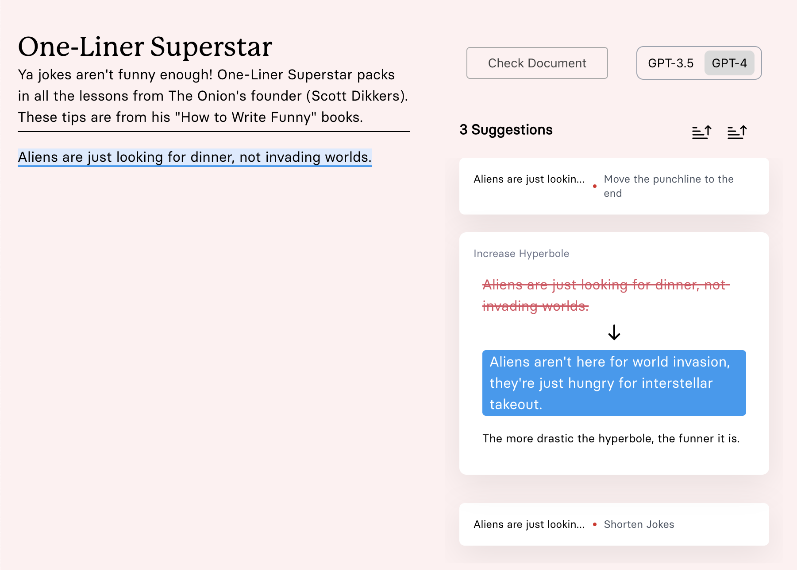

# Checklet



### Getting Started

1. make a directory called .vscode/ and make a file in it called settings.json where the contents of settings.json is .example.vscode.settings.json

2. `yarn install`

How to run it:

```
yarn run redis
yarn run dev
```

### Deployment

To deploy checklet, you need to read the documentation under the `deploy/` directory

Note: If you want to deploy your own Checklet with auth, make sure to setup firebase!
